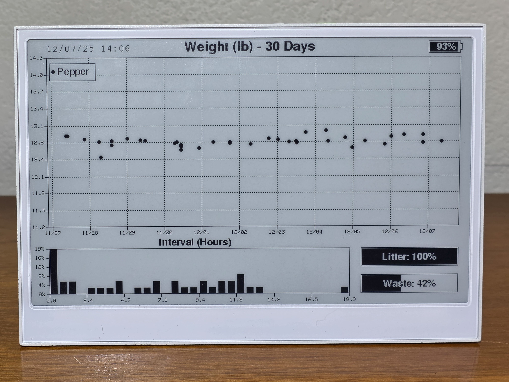

# Epaper Cat Tracking Dashboard

E1002 Color display, Petkit account

E1001 Black and white epaper, Whisker account

## Simple Multi-Cat Smart Litterbox Dashboard 

It collects data directly from petkit/whisker servers to help track pet weight and liitterbox usage patterns, and display litterbox status info. 

It should support up to four cats, and requires no setup besides using the captive portal to enter your wifi details and smart litterbox account login details. 

It stores 365 days of past usage data to its micro SD card, and has selectable plot date ranges that can be selected with the buttons. It connects to Petkit/whisker servers to request the most recent litterbox usage data every 2 hours, and spends the vast majority of time in deep sleep to conserve battery. 

It is able to determine your local timezone automatically, and synchronize itself and the built in RTC using NTP servers. Be sure to add a CR1225 battery to the holder inside, it does not come with one installed.

Whisker accounts without the paid tier have access to only 7 days of historical data, but the plot will grow to contain more data with time. Petkit accounts can access 30 days, and the records contain the duration of each visit, which allows plotting an additional histogram.

All settings and history data are read from and recorded to the micro SD card. So, be sure to install one. Must be 64GB or below, formatted FAT32. Data is all stored in JSON format, and can be manually edited or backed up. Swapping the SD card to another display is seamless. 

The device will host a captive portal to allow you to select your wifi access point and enter the password, and provide your petkit or whisker account login. Alternatively, after first boot, you can eject the micro SD and edit "secrets.json" to provide these details.

API for Petkit is based on PyPetkitApi, while the Whisker/Litter Robot API is based on PyLitterbot. These APIs are not publicly described by either company and might change at any time... The arduino library used for this project is [available here](https://github.com/earlynerd/SmartLitterbox).

## Compatibility
* Seeedstudio reterminal epaper displays E1001 or E1002
* All PetKit smart litterboxes (only Pura X tested...)
* Whisker Litter Robot 4 (possibly others, but untested).
* Micro SD <=64GB, FAT32

## Configuration

This project supports extensive customization via configuration files on the SD card.

### System Configuration
A file named `system_config.json` will be created on the SD card. You can edit this to tune system behavior:
```json
{
  "sleep_interval_min": 120,          // Normal update frequency in minutes
  "sleep_interval_low_batt_min": 360, // Update frequency when battery is low
  "battery_low_threshold_v": 3.5      // Voltage below which "Low Battery" mode triggers
}
```

### Dashboard Layout
You can completely customize the dashboard layout by editing `layout.json` on the SD card. If this file does not exist, a default layout will be created for you.

You can specify which widgets to show, their usage source, and their position/size on the screen.

**Supported Widgets:**

*   **Type:ScatterPlot**: Displays historical data points (e.g. Weight).
    *   `dataSource`: "scatter", "temperature_history", or "humidity_history"
*   **Type:Histogram**: Displays frequency distribution.
    *   `dataSource`: "interval" (Time between visits) or "duration" (Visit length)
*   **Type:LinearGauge**: A horizontal bar grap/gauge.
    *   `dataSource`: "battery", "litter", "waste", "temperature", or "humidity"
*   **Type:StatusBox**: (PetKit) Displays "Box FULL" / "Litter LOW" / "Box OK" status with color coding.
    *   `dataSource`: "petkit_status"
*   **Type:TextLabel**: Displays text or date/time.
    *   `dataSource`: "datetime" (uses `title` as strftime format), or leave empty for static text.
    *   `dataSource`: "temperature" or "humidity" (Displays current value as text)
    *   `title`: Format string like "%m/%d %H:%M"

**Example Layout Entry:**
```json
{
    "type": "TextLabel",
    "x": 20, "y": 10, "w": 200, "h": 20,
    "title": "%H:%M",
    "dataSource": "datetime"
}
```
